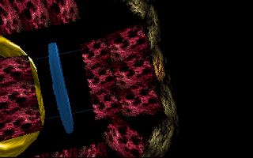

# VOODKA — 30th Anniversary Windows x64 Port (1996–2026)

**VOODKA** is the 30th Anniversary Windows x64 port of the 1996 MS-DOS demo by the
Polish demogroup **Absence**. The original was written in 32-bit x86 assembly
for a 386-class PC, an FPU, 8 MB of RAM, VGA mode 13h, and a Sound Blaster.
The port runs the production's eight scenes on modern Windows hardware while
preserving its 320×200 indexed-palette character, fixed-point arithmetic,
music-driven timeline, and wonderfully strange late-1990s atmosphere.

This repository contains both the modern port and the original source and
release as archival material. The original trees are provenance, not build
scratch space; all active development happens under `port/` and `docs/`.



## The short version

```powershell
cd port
.\build.ps1 -Config Release -Test
.\bin\Release\VOODKA.exe
```

The build produces a self-contained `port/bin/Release/` directory with the
demo, packed data, and soundtrack. The window is 1280×800: an exact 4×,
point-sampled presentation of the original 320×200 logical framebuffer. The
demo runs at approximately 70 frames per second and plays all eight scenes from
beginning to end. `VOODKA.exe` is built entirely from NASM x64 modules: no C or
C++ object, CRT, STL, exception runtime, or libxmp code is part of the shipped
demo.

## Why this port exists

This project is personal before it is technical. I first discovered **Voodka**,
together with **Budyn**, as a kid on a CD bundled with *CD-Action*. They were
among my first encounters with the demoscene, and Voodka in particular became
one of the productions that made me fall in love with it.

My first experiences with it were not straightforward. I repeatedly had
problems getting Voodka to run correctly on my computer. At one point I tried
downloading different copies from several sources over a **56 kbps modem**—a
slow and expensive process at the time—only to find that the versions I could
get were incomplete or broken.

Eventually I managed to "hack" one of those copies enough to make the demo
run. The original soundtrack/MOD was missing or corrupted, though, so I
substituted another module simply to experience the visuals. I never found a
working copy of the original soundtrack back then. As a result, I never
experienced the complete production correctly on my original machine.

Much later, I finally saw Voodka as it was meant to look and sound: first in
recordings such as YouTube captures, and eventually by running the original
production through DOSBox. That history is a major reason this port exists.
It is an attempt to preserve the thing I could not properly experience as a
child, and to make it easy to experience on a current Windows system.

The **2026 Windows x64 port was created with substantial assistance from AI**
for programming, reverse engineering, analysis, and debugging. Some people
in the demoscene may dismiss AI-assisted work as "AI slop", and I understand
that reaction. I do not pretend that this port represents the same kind of
achievement as writing an MS-DOS demo in assembly in 1996. The original
authors did that work themselves, under severe limits on hardware, memory,
CPU time, graphics, tools, and information.

This release is a **30th Anniversary Windows x64 Port of Voodka (1996–2026)**:
an act of preservation and a personal tribute to **Warlock and the original
team**, to the programmers, musicians, artists, and scene people who created
Voodka, and more broadly to the creativity and technical ingenuity of the
1996 demoscene. Modern hardware and AI-assisted development make the technical
environment completely different from the one in which the demo was made.
The purpose of this port is not to compete with or diminish that achievement,
but to understand it, preserve it, and keep it accessible. Without the
original authors and their work there would be nothing here to port; this
project exists because a demo found on a CD-ROM by a kid remained memorable
enough to come back to three decades later.

## A little history

VOODKA came from the intensely inventive PC demoscene of the mid-1990s. The
release package describes it as first presented at **Digital Art 1.5** and as
a democompo winner. Its feature list is a charming snapshot of the era:
virtual-reality scenes, toonel shading, twisted Phong-mapped textures, water,
reflections, 2D bump mapping, palette fades, text, and more effects than a
386 had any reasonable right to perform.

The original program is not a conventional application. It is a linked DOS
executable built from TASM assembly, custom include files, hand-packed binary
assets, and the EOS kernel. A filename such as `TABLICA3`, `WORLD.P!`, or
`P5.AS^` is not a missing extension or an accident: it is part of the
production's build language. The code writes VGA memory directly, changes the
DAC palette as an effect in its own right, patches instructions while running,
and uses a music position called `ModPos` as its clock.

Nearly thirty years later, the goal was not to redesign VOODKA as a modern
3D demo. The goal was to understand what the original actually did, replace
only the pieces that belonged to DOS, and let the old assembly keep speaking
for itself.

## The porting story

The first step was archaeology. The original source, the shipped executable,
the linker manifest, the DOS release notes, and DOSBox captures each answered
different questions. Some answers were in the source; others had to be
recovered from binary objects or inferred from the code that consumed them.

The most interesting discoveries included:

- The Borland Pascal linker packs 76 named files behind an 8000-byte offset
  table. The rebuilt archive is checked against the archive embedded in the
  original `VOODKA.EXE`.
- VGA palettes are 6-bit values, not ordinary 8-bit RGB. The port keeps the
  original palette arithmetic and converts to 8-bit only when uploading the
  palette texture.
- `.V3D` and `.V3M` are custom virtual-reality mesh formats. Their headers,
  vertex data, UV blocks, face records, Phong modes, and morph targets were
  reconstructed from the loader and validated against the real assets.
- The swiatynia city and torus ustep village scenes are authored world tables with object
  records, camera paths, painter sorting, back-face tests, and texture
  selectors—not pre-rendered scenes.
- torus ustep village's torus is a morphing 3D object over a render-to-texture water polygon.
  The reflection pass has its own precise object composition, mirror step,
  ripple tables, palette behavior, and 16-bit wraparound rules.
- Several palettes lived inside assembled OMF object files rather than as
  obvious standalone assets. They were recovered byte-for-byte, including the
  distinct processorek Nevosolek and nad czerwonym lampa material palettes.
- The original modifies instruction immediates for water, bump maps, fades,
  and animation. Since executable code is read-only under modern DEP, those
  sites became explicit state variables with the same widths and wraparound.

Then came the less glamorous archaeology: a 64-bit load that swallowed a
neighboring dword, a missing painter sort, an x64 ABI stack alignment error, a
selector that could no longer be represented by `fs`, and a single extra
word in a torus ustep village water reset that corrupted the reflection composition. Each bug
looked like an artistic problem until the assembly, the memory layout, and the
reference frame were compared together. That is the satisfying part of this
project: the strange image on screen is usually a precise clue about a tiny
piece of old machine code.

## Migration completion

The Windows production migration is complete. `VOODKA.exe` contains the
ported demo, EOS replacement, Win32 startup/window/input services, D3D11
presentation, dedicated tracker/audio worker, asset loading, logging, timing,
controls, and shutdown as NASM x64 modules. It enters through a native
assembly process entry and disables the default C/C++ libraries.

The C++ sources intentionally retained under `port/platform/` and
`port/tools/` are not production remnants: they form the separate
`VOODKA_REFERENCE.exe`, asset packers, viewers, and differential validators.
They provide migration evidence and cannot be linked into the shipped image.
The complete migration record is in
[`docs/ASSEMBLY_MIGRATION_PHASE3.md`](docs/ASSEMBLY_MIGRATION_PHASE3.md).

## What is preserved

The port retains the original eight-scene structure and its music-driven progression.
The parenthesized `P1`–`P8` labels below are historical source/build identifiers:

1. oko + szklo (P1) — the head, texture work, logos, and palette fades
2. swiatynia city — the stadium virtual-reality scene and reflective water (`P2`)
3. tunel + wygibasy (P3) — the twisted toonel and its textured hero object
4. processorek Nevosolek — the morphing plate/world sequence and picture outro (`P4`)
5. torus ustep village — the torus, colosseum ring, sun sprite, morph animation, and water (`P5`)
6. gratki (P6) — 2D bump mapping
7. gratki + woda (P7) — the multi-phase water effect
8. nad czerwonym lampa — the rotating object viewer and final outro (`P8`)

The port's video path is deliberately simple and faithful: the assembly draws
indexed pixels into a 320×200 backbuffer, the platform layer presents that
frame, and a D3D11 shader looks up each index through a 256-entry palette
texture. Nearest-neighbour sampling and integer scaling keep the hard-edged
VGA look instead of smoothing it into a modern texture.

The original soundtrack is the 14-channel FastTracker module `<>Amnezja<>`
by Szudi, dated 29 July 1996 in the recovered asset metadata. The shipped port
uses a dedicated NASM tracker, mixer, ring, and event-driven WASAPI worker at
44.1 kHz stereo. Its `ModPos` value is represented as `(order << 8) | row`, just
as the demo expects, so scene changes, palette flashes, morphs, camera movement,
and animation are driven by the same musical timeline rather than by an
unrelated wall clock. Vendored libxmp remains only in `VOODKA_REFERENCE.exe`
and host-side differential tests.

## Original authors: tribute and credits

> **The work that made VOODKA possible belongs to Absence and its original
> collaborators.** The Windows port is a preservation and appreciation
> project. It does not replace, re-author, or claim ownership of the 1996
> production, its code, its graphics, its music, or its tools.

The following is the credit block from the shipped release's `VOODKA.NFO`,
preserved here with the original names and roles:

| Original credit | Name(s) |
| --- | --- |
| Code | **Warlock & Nuke** |
| Music | **Szudi** |
| Graphics | **Grass, Orgy, Nuke & Warlock** |
| Design | **Warlock & Nuke** |
| Objects | **Walker** |
| Kernel | **E.O.S.** |
| Palette fading | **Warlock** |
| Moral support and some graphics | **Walker** |
| Exit to DOS | **Nuke** |
| “Bulka & Coclet” support | **Nuke's mother** |
| Rama | The release's playful “bzdety” credit |

The archival source NFO spells the musician's name `Sudi`; the shipped release
uses `Szudi`, and the module metadata identifies the author as Szudi / Szymon
Szuchaja. The complete original notes—including the authors' tool list,
special greetings, jokes, and period spelling—remain in
[`reference/release/abc_voda/VOODKA.NFO`](reference/release/abc_voda/VOODKA.NFO).

The original release also acknowledges the EOS kernel, the graphics catalog
sources used by the authors, and the people named in its extensive greetings.
Those acknowledgements remain part of the archival release and are not
silently rewritten as modern port credits.

## Building on Windows

### Requirements

- Windows 10 or 11, x64
- Visual Studio 2022 or its Build Tools, with the x64 C++ toolchain and Windows
  SDK (`build.ps1` can also locate a newer Visual Studio installation)
- CMake 3.24 or newer on `PATH`
- PowerShell 7 or newer

NASM 2.16.03 is vendored under `modules/`. libxmp 4.6.2 is also vendored, but
is used only by the non-shipped C++ reference/oracle tools. No package manager,
DOS compiler, TASM installation, or external runtime audio library is needed
by `VOODKA.exe`.

### Build and test

```powershell
cd port
.\build.ps1 -Config Release
.\build.ps1 -Config Release -Test
```

For a clean rebuild:

```powershell
.\build.ps1 -Clean -Config Release -Test
```

The script initializes the Visual Studio environment, configures CMake for
x64, explicitly selects the vendored NASM, builds the demo and tools, and can
run the complete CTest suite. The finished port has **88 tests** covering
assembly/reference equivalence, archive and palette reproducibility, real
V3D/V3M decoding, water tables, tracker/mixer PCM, WASAPI lifecycle, A/V
timeline behavior, shutdown, relocation hygiene, and asset-viewer parsing.

If configuring CMake manually, pass the vendored assembler explicitly:

```powershell
cmake -S . -B build\Release -G "Visual Studio 17 2022" -A x64 `
  -DCMAKE_ASM_NASM_COMPILER="$pwd\..\modules\nasm\nasm.exe"
```

Using a different NASM version can silently break `[rel X]` references in
high-address data and produce convincing but corrupted failures. The build
script avoids that trap.

### Tagged releases

Pushing a tag named `voodka-port-v<major>.<minor>.<patch>` starts the GitHub
Actions release workflow. It performs a clean Release x64 build, runs the full
CTest and production playback gates, validates the executable's imports and
the isolated runtime package, then publishes `VOODKA-<tag>.zip` to the matching
GitHub Release. The workflow runs on `windows-2022` and uses the vendored NASM;
no local tag or commit is created by CI.

### Build output

`port/bin/Release/` contains:

```text
VOODKA.exe                 the complete demo
VOODKA_REFERENCE.exe       non-shipped C++/libxmp behavioral oracle
VIRTUAL.exe                standalone VR-engine loader/viewer harness
asset_viewer.exe           explorer for the original 3D assets
data/vodka.dat             packed demo assets
data/world                 packed VIRTUAL world objects
music/amnezja2.mod         the original soundtrack
*_selftest.exe              validation tools used by CTest
frames2img.exe             recorded-frame converter
```

The demo directory is self-contained. To reproduce the release package after
building, run:

```powershell
.\port\package_release.ps1 -Config Release -Version voodka-port-v1.1.0
```

This creates `port/release/VOODKA-voodka-port-v1.1.0.zip`. The archive keeps
`VOODKA.exe`, `data/vodka.dat`, and `music/amnezja2.mod` in the same release
directory layout expected by the application and includes the root README. It
does not include `docs/`, source code, tests, development utilities, debug
files, or intermediate build artifacts.

## Running the demo

From `port`:

```powershell
.\bin\Release\VOODKA.exe
```

Useful entry and diagnostic options:

```text
VOODKA.exe --scene <name>       start by canonical scene slug
VOODKA.exe --part N             historical numeric scene selector (1..8)
VOODKA.exe --modpos N           start at an absolute (order<<8)|row position
VOODKA.exe --order N            start at a module order
VOODKA.exe --ms N               start at a millisecond offset
VOODKA.exe --music <file>       use a different module file
VOODKA.exe --record <directory> record each 320x200 frame and its palette
VOODKA.exe --diag <directory>   enable GPU readback diagnostics
VOODKA.exe --audiocheck [sec]   exercise the audio path without the demo
VOODKA.exe --selftest           show the built-in presentation test pattern
```

Controls:

- **Space** pauses or resumes the demo, including its retrace-paced timeline
  and audio.
- **Esc** exits immediately from every scene, effect, loading phase, and
  playback position. It stops audio/rendering, joins worker threads, releases
  platform resources, closes the window, and terminates the process.
- The window is intentionally topmost; normal Alt+Tab switching remains
  available.

For a silent timing run, set `VOODKA_NOAUDIO=1` before launching. The file
`voodka.log` beside the executable records initialization, asset paths, scene
transitions, and crash diagnostics.

## Explorers and debugging tools

The port includes tools that make the reconstruction inspectable rather than
turning it into a black box:

- `asset_viewer.exe` loads every shipped 3D asset: archive V3D/V3M files,
  compile-time `CODE/DATAS` meshes, and the two VIRTUAL objects. Number keys
  select models, `[` and `]` browse, **Space** toggles wireframe, **R** toggles
  rotation, and mouse drag/wheel controls the orbit camera.
- `VIRTUAL.exe --check` loads the standalone world archive through the real
  ported object loader and exits; without `--check`, it opens the interactive
  viewer.
- `frames2img.exe` converts `frames.raw` from `--record` into PNG frames for
  phase-aligned visual comparison.
- `vodka_pack`, `world_pack`, `tabl2nasm`, `extract_v3d`, palette extractors,
  and the `*_selftest.exe` programs expose the data and format pipeline used
  during reconstruction.

The most useful debugging loop is often: run a single scene with
`--scene torus-ustep-village`, record a short sequence, convert it with
`frames2img`, and compare it with the
matching DOSBox capture under [`reference/captures/`](reference/captures/).
The raw indexed frame and palette are more informative than a screenshot when
the question is whether an old DAC effect, texture index, or rasterizer branch
is correct.

## Architecture

```text
VOODKA.exe
  port/core/ + port/platform/*.asm     NASM x64 demo, EOS replacement,
                                        Win32/D3D11/WASAPI platform, audio,
                                        renderer, scenes, and shutdown
  Windows import libraries             Win32, COM, D3D11, DXGI, WASAPI support
  generated shaders + vodka.dat        self-contained runtime assets

VOODKA_REFERENCE.exe + host tools      C++ differential/oracle and packaging
                                        programs; never linked into VOODKA.exe

reference/                              original source, release, and captures
```

The assembly core remains assembly on purpose. That preserves the original's
16-bit and 32-bit truncation, signed arithmetic, x87 operations, fixed-point
formats, save/restore discipline, and deliberately unusual data layout. The
The retained C++ implementations are verification/oracle code, not the
production platform or rendering engine. The production assembly calls only
the documented Windows ABI and explicit NASM-owned service boundaries.

The major platform substitutions are:

- EOS memory, selectors, timing, input, file, logging, and lifecycle services
  become a small NASM Win32 layer over one 64 MB arena.
- The original `fs`-based selector convention becomes an explicit selector
  table because user-mode x64 cannot assign arbitrary segment bases.
- VGA framebuffer copies become an R8 index texture plus a 256×1 palette
  lookup texture in D3D11.
- The original Sound Blaster/DIAMOND path becomes the dedicated NASM tracker,
  mixer, and WASAPI worker.
- DOS retrace waits become a QPC-paced ~70 Hz tick source. The audio position
  still supplies the scene timeline, so visual timing and soundtrack remain
  coupled.

For the source-level details, see:

- [`docs/BUILDING.md`](docs/BUILDING.md) — build, run, test, and tool reference
- [`docs/PORTING_NOTES.md`](docs/PORTING_NOTES.md) — architecture and hard-won
  invariants
- [`docs/ASSET_FORMATS.md`](docs/ASSET_FORMATS.md) — reconstructed binary
  formats and color pipeline
- [`docs/WORLD_ARCHITECTURE.md`](docs/WORLD_ARCHITECTURE.md) — swiatynia city and
  torus ustep village worlds,
  camera paths, sorting, morphs, and water
- [`docs/P4_P8_SCENES.md`](docs/P4_P8_SCENES.md) — detailed processorek Nevosolek
  and nad czerwonym lampa scene
  reconstruction
- [`docs/ASSETS.md`](docs/ASSETS.md) — the 76-entry archive inventory
- [`docs/KNOWN_DIFFERENCES.md`](docs/KNOWN_DIFFERENCES.md) — measured port
  differences and validation notes
- [`docs/FLASH_EFFECTS.md`](docs/FLASH_EFFECTS.md) — palette/DAC flash timing

## Known differences from the 1996 release

The port aims for behavioral and visual fidelity, but it is not pretending to
be the same hardware:

- The presentation is a windowed 1280×800 D3D11 surface rather than fullscreen
  VGA mode 13h. It uses square pixels; the original CRT/DOS display had a
  different physical pixel aspect.
- The original uses its binary-only DIAMOND player and Sound Blaster output.
  The port uses its dedicated assembly player at 44.1 kHz through WASAPI. The
  retained libxmp build is a reference oracle only. Under DOSBox/SB16 the
  original's measured playback is about five percent slower; both versions
  remain internally synchronized because scene changes are driven by
  `ModPos`.
- The original's FPU precalculation creates a visible startup pause in DOSBox;
  the port performs the same required work much faster.
- A few extreme out-of-grid water samples in the swiatynia city/gratki + woda effects read undefined
  DOS memory in the original. The port clamps those edge reads for safety;
torus ustep village retains its original 16-bit sample wrap.
- The regenerated sine table uses the mathematically equivalent port table
  where the original source table is absent; the measured deviation is small
  and documented.
- Space-to-pause is a small port addition. ESC is intentionally a global
  platform quit override so it remains reliable while the assembly core is
  loading or rendering a scene that does not consume keyboard input.

The archive, world records, mesh decoders, palettes, camera data, rasterizer
math, effects, synchronized flashes, and final presentation stages are covered
by the reconstruction tests and reference captures. Differences that are
hardware-specific or not safely defined by the original are documented rather
than hidden.

## Repository map and provenance

```text
demoscene-absence-voodka-master/   working archival source tree
reference/source/                  byte-identical read-only source mirror
reference/release/                 shipped 1996 release and original NFO
reference/captures/                DOSBox reference frames and comparisons
music/amnezja2.mod                 original soundtrack used by the port
modules/                           vendored NASM and libxmp
port/                              active native Windows x64 implementation
docs/                              reconstruction and validation notes
```

Please preserve the original source and release trees. They are part of the
historical record, and the port is most useful when its modern code can still
be compared directly with the material that inspired it.

## License and respect for the source

This repository is a preservation/reconstruction project. The original
VOODKA code, art, music, names, and release materials remain associated with
their original authors and respective rights holders. Please retain the
original credits and archive contents when redistributing or building on this
work, and do not present the modern port as the original production.

The most important result is simple: VOODKA can once again be run, inspected,
and enjoyed without needing a 386, a Sound Blaster, or a trip through a DOS
memory map. The old demo gets to keep its palette flashes, its impossible
water, its wobbly virtual worlds, and its soundtrack—and we get to see how it
was done.
