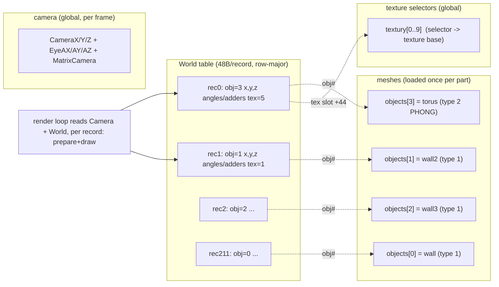
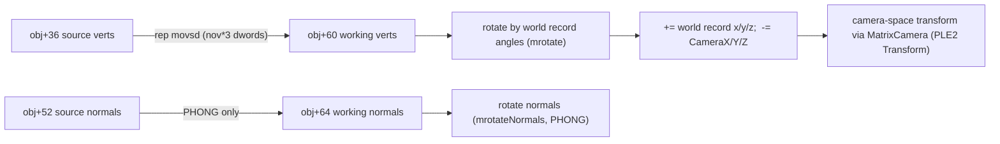
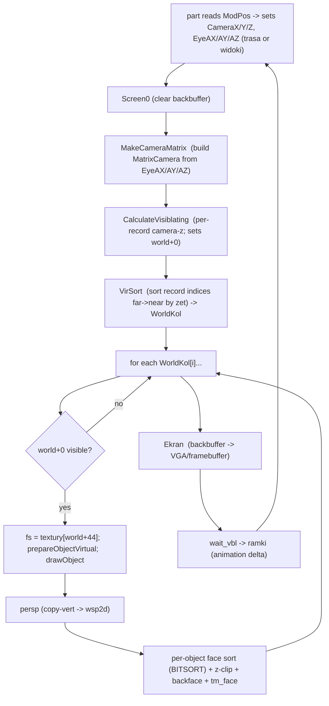
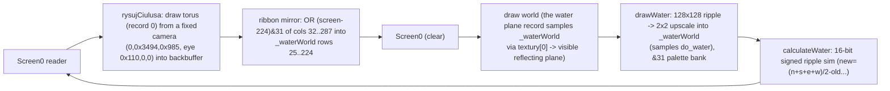

# VOODKA 3D world architecture — the VR scene engine

This doc reconstructs how the 1996 demo builds and renders its two 3D worlds
(swiatynia city (P2)'s stadium, torus ustep village (P5)'s colosseum-ring) and the standalone VIRTUAL harness: a flat
table of 48-byte "instance" records pointing at shared V3D meshes, a global
camera, and a one-point-perspective raster pipeline with **no z-buffer, no
frustum and no lighting** — depth comes from two far→near painter sorts and
illumination is baked into palettes and textures. Read §1–§3 for the data
model, §6 for the per-frame pipeline, §10 for the two worlds, §12 for how the
port (`port/`) maps 1:1, and §13 for port-maintenance gotchas.

---

How the original demo defines, assembles, and renders its 3D worlds. This is
the scene-level companion to `ASSET_FORMATS.md` (per-byte formats) and
`PORTING_NOTES.md` (ABI/memory). It answers: what a "world" is, how objects
and cameras are described, how one frame becomes the 320x200 screen, and how
the modern port (in `port/`) reproduces it.

Scope: the demo contains **two true 3D worlds** — swiatynia city (P2) (a "stadium") and torus ustep village (P5)
(a "colosseum ring" over water) — plus a third, `VIRTUAL`, a dev harness that
is **not** linked into the shipped demo. All three are driven by the same
"VR engine" (`CODE/INC/VIRTUAL.INC` / `VIRTUAL2.INC` + `OBJECTS.PM` +
`BITSORT.PM` + `MROTATE.PM` + `PERSP.PM`). The oko + szklo, tunel + wygibasy,
processorek Nevosolek, gratki, gratki + woda, and nad czerwonym lampa scenes (P1/P3/P4/P6/P7/P8) are not
world-based (see §10.4); they reuse lower-level primitives (rotate/persp/
sort/normals) but have no `World` table.

Primary sources (all in `demoscene-absence-voodka-master/`):

| File | Role |
|---|---|
| `CODE/INC/VIRTUAL.INC` | VR world engine, swiatynia city (P2) variant (PrepareObjectVirtual, CalculateVisiblating, MakeCameraMatrix) |
| `CODE/INC/VIRTUAL2.INC` | same, torus ustep village (P5) variant (objects2/world2) |
| `CODE/INC/OBJECTS.PM` (+`OBJECTS2.PM`) | object loader + `DrawObject`/`DrawZielonyLudek` raster dispatch |
| `CODE/INC/PLE2` | `Transform` — camera-space matrix multiply |
| `CODE/INC/MROTATE.PM` | Euler rotation matrix + `mrotate`/`mrotateNormals` |
| `CODE/INC/PERSP.PM` | perspective projection |
| `CODE/INC/BITSORT.PM`, `VIRSORT.PM` | per-object face sort + per-world object sort |
| `CODE/INC/VISIBLE.PM` | 2D backface test |
| `CODE/INC/TXTR.ASM` | `tm_face` scanline texture mapper |
| `CODE/INC/NORMALS.PM` | PHONG face/vertex normals (load time) |
| `CODE/INC/WORLD`, `P5/WORLD` | the two world **tables** (212 / 45 records) |
| `CODE/INC/SIN`, `MROTATE.PM` sin | Q15 1024-entry sine (angles in units of 1024/rev) |
| `CODE/P2/P2.AS^`, `CODE/P5/P5.AS^` | per-part scene drivers (timeline, camera, scripts) |
| `CODE/P2/TRASA.!`, `P5/TRASA.!`, `P2/WIDOKI` | camera path / scripted stills |
| `CODE/WORLD/WORLD.ASM`, `CODE/WORLD/WORLD.V3D` | object-authoring harness + a dev snapshot of the torus ustep village (P5) world |
| `VIRTUAL/OBJECTS/WORLD.PAS` (+ `WORLD`) | VIRTUAL object archive packer + archive |

Port mirrors (in `port/`): `core/engine/{vprep,vrot,vvis,p2loop,p2draw,
cammat,loader,mrotate,persp,txtr,normals}.asm`, `core/data/{p2world,
p2trasa,p2widoki}.inc`, `core/parts/p5_world.inc`, `core/parts/p5_trasa.inc`.

---

## 1. What a "world" is: flat instancing, no hierarchy

A world is **one flat table of 48-byte records**. There is no scene graph, no
parent/child transforms, no bounding volumes, no per-frame scene construction.
Each record is an *instance*: it points at a mesh (`object no`) and provides
that instance's position, Euler angles, per-frame angular velocity (spin
adders) and a texture-slot index. The meshes themselves are loaded **once**
per part into a fixed array `objects[0..9]`; the world table reuses/instances
them at different transforms. `WorldsObjects` is computed at assembly time:

```
WorldsObjects dd ((offset EndWorld) - (offset World)) / 48
```

Diagram of the runtime relationship:



The renderer walks the table in a *sorted* order (depth, far→near, §7) and
for each visible record transforms the referenced mesh into camera space,
projects it, and rasterizes it with the texture selected by the record's slot.

---

## 2. The object: `.V3D` file + the 21-dword runtime struct

### 2.1 File layout (`.V3D`)

Tiny COM-style images: `tasm` source → `tlink /x/3/t` → `.COM` renamed
`.V3D` (`CODE/WORLD/VC.EXT`), so there is no file header and data starts at
byte 0. `.V3M` is the same blob **minus the 36-byte header** (torus ustep village (P5) morph
target). Full byte map: `ASSET_FORMATS.md` §4.1.

| Offset | Size | Field |
|---:|---:|---|
| +0 | 4 | type: 0=PIXELS, 1=TEXTURES, 2=PHONG |
| +4 | 4 | `nov` vertices |
| +8 | 4 | `nof` faces |
| +12/+16/+20 | 12 | per-object AngleX/Y/Z **adders** (auto-spin) |
| +24..+35 | 12 | unused by the parser |
| +36 | nov×12 | vertices (x,y,z) `dd` — **scaled ×16 in place at load** |
| … | nof×12 | faces (i0,i1,i2) `dd` |
| … | nov×8 | per-vertex (u,v) `dd` — read only for type 1 |

Assets in the archive: `wall/wall2/wall3` (4 v / 2 f, type 1) and `torus`
(346 v / 688 f, type 2). torus ustep village (P5): `2wall*` (4/2) and `2torus` (128 v / 256 f,
type 2). All geometry is authored around the origin and **centered** (wall
x∈[−600,600] y∈[−300,300]; torus ±~400; 2torus ±820). The wall variants
differ in size and in their per-vertex UV window (wall UV (5,5)..(120,120);
wall3 samples a shifted band (134,6)..(250,119)) — the same texture slot can
therefore show different texture slices per wall kind.

### 2.2 The 21-dword runtime object struct (all offsets arena-relative)

Allocated and zeroed by `Load_Object` (`OBJECTS.PM:341-436`), stored in
`objects[]`:

| + | Field | Meaning |
|--:|---|---|
| 0 | type | 0 PIXELS / 1 TEXTURES / 2 PHONG |
| 4 | nov | vertex count |
| 8 | nof | face count |
| 12/16/20 | AngleX/Y/Z | current rotation angles (init 0; the part may script them) |
| 24/28/32 | AngleX/Y/Z | spin **adders**, copied from the file's +12/16/20 |
| 36 | vertexes | → the ×16-scaled source vertices (inside the file image) |
| 40 | faces | → the face table (in the file image) |
| 44 | textures | → per-vertex UV block (TEXTURES only) |
| 48 | normals | → per-face normals working block (nof×32; PHONG) |
| 52 | wersory | → source vertex normals (PHONG) |
| 56 | adders to color | allocated (nof×12) but **never written or read** — see §8 |
| 60 | copy-vert | → per-frame working vertex copy (nov×12) |
| 64 | copy-wersory | → per-frame working normal copy (nov×12) |
| 68 | normals-copy | → per-frame working face-normal copy (PHONG) |
| 72 | tex-sel (word) | `textury[loadArg]` — filled but **unused at runtime** (the *world* record picks the texture) |
| 76 | wsp2d | → per-frame 2D projection output (nov×8) |
| 80 | order | → per-object face sort order + zetas (nof×4) |

The ± working buffers (48/52..76/80) are one bump allocation of
`nof·60 + nov·44` bytes. Vertex normals for PHONG are built at load time by
`calcNormals` (face normals = edge cross products normalized to length 250,
then averaged per vertex — `NORMALS.PM`).

### 2.3 Per-frame object pipeline (called once per world record)



In code this is `PrepareObjectVirtual` (`VIRTUAL.INC`) → it copies the mesh
into the working buffers, overwrites `obj+12/16/20` with the **world record's
angles**, rotates (object space), then `PrepareVirtualPoints` adds the record
position, subtracts the camera, and applies the camera matrix. `RotateObj`
(`OBJECTS.PM`) is the non-virtual twin used by the object-only parts.

### 2.4 Perspective projection

`PERSP.PM` — for every working vertex `(x,y,z)` (world→camera space):

```
z_tmp = z + 185*16          ; z near-plane is at z = -2960 (185*16)
x_s = (x * 185) / z_tmp + 160
y_s = (y * 185) / z_tmp + 100
```

Focal length 185 in the post-×16 unit space, screen center (160,100).
Division by zero is clamped (`inc ebx`). The `+185*16` shift means "visible"
camera z starts at ≥1 (§7); vertices closer than −2960 push through the
divisor sign and are culled individually by the per-face near test.

---

## 3. The world record: 48 bytes = 12 dwords

Field layout is written verbatim in `CODE/INC/WORLD.INC`/`WORLD2.INC`:

```
World:         00 (dd) - is visible object      (written per frame, see §7.1)
               04 (dd) - X position in World
               08 (dd) - Y position in World
               12 (dd) - Z position in World
               16 (dd) - object Number           (index into objects[])
               20 (dd) - AngleX of Object'
               24 (dd) - AngleY of Object
               28 (dd) - AngleZ of Object
               32 (dd) - adder to AngleX
               36 (dd) - adder to AngleY
               40 (dd) - adder to AngleZ
               44 (dd) - type of virt'object'    (really: TEXTURE-SLOT index into textury[])
```

Authoring example (swiatynia city (P2) world record 0 — the env-mapped torus):

```
dd 0, 150*16, -650*16, 2150*16,   3,  256,0,0,   0,0,0, 5
   |  |        |        |         |   |   |  |   angles adders     +44=5
   |  |        |        |         |   |   angleZ
   |  |        |        |         |   angleX(256 = 90deg)
   |  |        |        |         obj# = 3 (torus)
   |  |        |        z=2150*16 (in 1/16 units -> 2150 world units)
   |  |        y=-650*16
   |  x=150*16
   +0 visible (overwritten each frame)
```

Positions are authored ×16 (like vertices); angles are in units of 1/1024
turn (256 = 90°), wrapped `& 0x3ff` at use. `+0` is *always* overwritten by
`CalculateVisiblating` each frame — the authoring value is irrelevant. `+44`
is the index into the global **texture-selector table** `textury[]`; the
comment calls it "type of virt object" but its only consumer is
`mov ax, textury[world+44]` to select the fs texture for that instance.

`+32/36/40` spin adders are applied by the "katys" loop in each part's frame:
`world[i].angle += world[i].adder` for every record, every frame.

---

## 4. Coordinate systems

| Space | Units | Notes |
|---|---|---|
| Object space | authoring units (×16 at load → runtime units) | meshes authored centered around origin |
| World space | 1/16 units (record x/y/z written `val*16`) | translation only; no hierarchy |
| Camera space | 1/16 units | `R_cam · (R_obj·v + world − cam)` |
| Screen | pixels | `(x·185/(z+2960))+160`, `(y·185/(z+2960))+100` |

`MatrixCamera` is the camera rotation, stored as a 4×4 dword array (offsets
0..60) but with **only the 3×3 upper-left block** written (`m11..m33`); row
*i* at offsets `{0,4,8}`/`{16,20,24}`/`{32,36,40}`. `MakeCameraMatrix`
(`VIRTUAL.INC`) builds it from `EyeAX/EyeAY/EyeAZ` via the sine table:

```
sin_k = SIN[(angle_k      ) & 0x3ff]      (Q15, 1024-entry table)
cos_k = SIN[(angle_k + 256) & 0x3ff]
m11 = c2*c3        m12 = s3*c2          m13 = -s2
m21 = -s3c1-c3s2s1 m22 = c3c1-s3s2s1    m23 = -c2s1
m31 = -s3s1+c3s2c1 m32 = c3s1+s3s2c1    m33 = c2c1
```

This is the conventional Euler rotation (the angle-2 axis contributes
`-s2` on m13, i.e. a pitch-like term), SAR-truncated to Q15. Note the SMC trick: the original patches
instruction immediates (`_sin3_sin1` etc.) to spill the low-32 products; the
port keeps them in bss vars (`cammat.asm`) with identical arithmetic.
`Transform` (`PLE2`) then applies `out = row_i · v` per axis; column 3
(m13,m23,m33) is the camera's **forward** axis, reused by the visibility test
(§7.1), which is why `camera z` here corresponds to distance.

---

## 5. Camera

The camera is **not** part of the world table. It is three globals —
`CameraX/Y/Z` (position) and `EyeAX/AY/AZ` (orientation) — set *before* the
frame by the part from one of two data sources, then `MakeCameraMatrix` is
called once per frame.

### 5.1 Camera paths (flight) — `TRASA.!`

`P2/TRASA.!` = 2,964 nodes, `P5/TRASA.!` = 3,876 nodes, of 6 `dd`:
`CameraX, CameraY, CameraZ, EyeAX, EyeAY, EyeAZ` (24 B). The part keeps a
`trasa_ruch` cursor, reads `trasa[trasa_ruch*24]`, and advances it by the
frame's `ramki` delta (scaled early in swiatynia city (P2); wrapped at `ruchow-2` in torus ustep village (P5)).
No interpolation — the position is a step function along a pre-baked path.
(The *binary* `trasa.dat`/`tr2.dat` for processorek Nevosolek/nad czerwonym lampa (P4/P8) are a different 9-dword format:
`ASSET_FORMATS.md` §4.6.)

### 5.2 Scripted stills — swiatynia city (P2) `WIDOKI`

`P2/WIDOKI` expands to 64 entries × 7 dwords: `x,y,z, ax,ay,az, flashFlag`.
Active when `ModPos > 0x63f`; index = `ModPos & 0x3f`. Each entry pairs a
flash variant (flag=1 → white palette flash via `plum` guard) with three
non-flash copies. swiatynia city (P2)'s timeline: camera-path mode (0x400..0x63f, cursor
advance slows and then freezes ≥0x600 per §10.1), then scripted
still-camera cuts with palette flashes (until the water stage).

### 5.3 Camera conventions

swiatynia city/torus ustep village (P2/P5) camera paths place the camera at (typically far-above/around) the
world; the eye angles aim it. E.g. torus ustep village (P5) trasa opens at (1921, −5763, −30222)
with `EyeAZ` ramping 0,2,4,… — a slow scan. Because the engine never clips a
frustum (see §7), "behind" content is culled only by the object/face near
tests, and distant content is simply very small.

---

## 6. Per-frame render loop (both worlds)



Both P2.AS^ and P5.AS^ implement exactly this skeleton (swiatynia city (P2) in `Main`/`Main2`,
torus ustep village (P5) in `Main`); `port/core/engine/p2loop.asm` is the NASM port of the
"calc visibility → world sort → walk" part, with a `trace` mode that records
the dispatch order for the CTest.

---

## 7. Visibility, culling, and the painter's sort

There is **no frustum culling, no clip planes, and no z-buffer**. Correctness
comes from three cheap per-level tests plus two painter sorts:

1. **Object level** — `CalculateVisiblating` computes, for each world record,
   `zet = (x−camX)·m13 + (y−camY)·m23 + (z−camZ)·m33` (the camera-space
   *forward* distance of the record's origin, `shrd 15`) and writes
   `world+0 = (zet >= ZetVisible=1)`. Records behind the camera are skipped
   entirely.
2. **World sort** — `VirSort` sorts the record indices **descending by the
   low 16 bits of zet** (far→near): the walk above draws farthest objects
   first, nearest last. (See the quirk in §7.2.)
3. **Per-object, per-face** — inside `DrawZielonyLudek` each face's three
   vertices are individually near-clipped (`copy-vert[vertex][z] >= 1`), then
   a 2D backface test (`VISIBLE.PM`, signed cross-product of the first two
   projected edges) culls away-facing faces, and `tm_face` rasterizes what
   survives. Faces are drawn in per-object depth order via the engine's
   `prep_sort`/`sort` (BITSORT, see below).

### 7.1 The VirSort packing quirk (faithful, not a bug)

`VIRSORT.PM` packs each record's sort key with the record index in the high
half (`mov bx,[zet_low16]; …; add ebx,010000h`), then runs a 4-pass 4-bit
radix bucket sort, gathering buckets **15→0** (descending). Only the **low 16
bits** of the key are ever touched by the four nibble passes (shifts
0,4,8,12) — the high bits (record index) never participate in the ordering,
so effectively **objects are drawn in descending low-16-bit camera-z order
(far→near)**; the index packing is a harmless vestige. torus ustep village (P5)'s
copy (`P5/VIRSORT.PM`) additionally does `sar bx,4` on the key (a 4-bit
scale). The port (`vvis.asm`) reproduces the same key semantics — a stable
descending sort of `(int16)low16(zet) >> shift` — with `virsort_shift` = 0
(swiatynia city (P2)) / 4 (torus ustep village (P5)) and documents it as such. Because both shipped worlds are
closed tile-able stadiums of opaque quads, order is largely invisible, but it
is what the original did and the port matches it.

The per-object face sort (`BITSORT.PM Sort`) is the same construction: key =
`(faceIdx<<16) | (lo16(z1>>4)+lo16(z2>>4)+lo16(z3>>4)+ 15000)`, bucket-gather
15→0, `NaGut` keeps the high half → face draw order is far→near. `SortMem`
(prep_sort) allocates the 16-bucket scratch (1000×16 dwords) at part start.

---

## 8. Textures, materials, lighting

- **`textury[]`** — a demo-global word table of **selectors** (texture
  handles over the arena), `dw 10 dup (?)` (`DEMO.AS^`). Filled by
  `CODE/PART2` (loaded early in `Start32`): `textury[1]=t001`, `textury[2..4]
  all=t002`, `textury[5]=env`. swiatynia city (P2) allocates `textury[0]` over its 256×256
  water scratch. torus ustep village (P5) allocates `textury[0]=waterWorld`, `[1]=2T001`,
  `[2]=2T002`, `[3]=2ENV`.
- **Per-instance texturing**: the world record's `+44` indexes this table;
  the render loop sets `fs = textury[world+44]` before drawing each record.
  So a single mesh (e.g. `wall2`) renders with different textures in
  different records. The object struct's own `+72` tex-sel is dead in the
  shipped demo (the world always overrides it).
- **Texture mapping** (`tm_face`): scanline triangle mapper; per-vertex UVs
  are 8.8 fixed, `texel = texture[(V<<8)|U]` (256-stride wrap); U/V wrap
  mod 256. No transparency, no filtering. Walls are single-tile quads (UV
  5..120 → a 115×115 window into the 256-wide texture).
- **PHONG ("env-map") objects** — the torus inside the stadium. Faces are
  drawn using the **rotated vertex normals** as the env UV:
  `envUV = (n>>1) + 128` (roling=1, addtoenv=128) against a 256×256 env map
  (`env.dat` / `2ENV.DAT`). No reflection vector; it is a normal→equirect
  lookup baked into the palette.
- **Lighting: none.** The VR engine performs no shading, no light sources, no
  per-face color. Illumination is *baked*: each texture's colors sit in a
  tuned palette range (swiatynia city (P2)'s stadium under the inline `jjdj` palette gives the
  red/maroon/blue look; torus ustep village (P5) under `2WORLD.PAL` gives olive/gold/tan). The
  `+56 "adders to color"` field in the object struct is **allocated but never
  written or read** — an unimplemented per-face shading idea. (Per-face
  additive shading *does* exist in tunel + wygibasy/processorek Nevosolek/nad czerwonym lampa (P3/P4/P8), but that is the *other*,
  non-world object renderer — `ENGINE.ASM`/`face()`/`show` with `add al,cl`
  — not the VR engine.)
- Alpha/transparency is a per-blitter convention only (index-0 skips in
  sprite blitters; the swiatynia city/torus ustep village (P2/P5) water uses `&31` bank tricks), never a texture
  property.

---

## 9. Animation

Four mechanisms, all timeline (ModPos) or frame-delta driven:

1. **Spin adders (katys)** — every world record's `+32/36/40` accumulate into
   `+20/24/28` every frame. Most walls use (0,0,0) (static); the torus ustep village (P5) torus
   record in the *dev* snapshot had (8,5,0); the shipped torus ustep village (P5) uses (0,0,0) and
   animates by scripting instead.
2. **swiatynia city (P2) torus script** — for ModPos ≥ 0x600, `P2.AS^` reads the inline
   `obroty` table (20× 3 dwords of dax/day/daz, indexed `ModPos & 0xf`) into
   `world+20/24/28`, driving a rotating env torus above the stadium.
3. **torus ustep village (P5) morph (`.V3M`)** — `2Torus.V3M` is `2Torus.V3D` minus its header.
   torus ustep village (P5) scales it ×16, then `MakeMorphTable` precomputes **64 chained lerp
   frames** (16.16 delta `((target−source)<<16)>>6`, each frame 128 verts ×
   12 B = 1536 B) into `_tabMorph`, with `MorphAddreses[0..63]` pointing at
   each frame. During the fly-over the part patches `objects[3]+36` (the
   vertex pointer) to `MorphAddreses[ktoryMorph]` (ping-pong ±5 between
   0..62) — a vertex-level morph of the torus, plus a manual world+20 spin
   (`ramki*3`).
4. **Sprite overlays** — the "sun" eye animations:
   `klatki.dat`/`2world.inc`/`log.inc` 64×64 frame stacks blitted
   (index-0 transparent) to the backbuffer each frame at (254,141), with
   frame index advancing by `ramki/4 · bolek` (±1 direction in swiatynia city/torus ustep village (P2/P5)). These
   are 2D overlays, not part of the 3D world.

---

## 10. The two shipped worlds

### 10.1 swiatynia city (P2) — the stadium (212 records)

Loaded objects: `wall` (obj 0), `wall2` (1), `wall3` (2), `torus` (3).
`textury[1]=t001, [2..4]=t002, [5]=env`. 212 records build: a long central
floor (t001), two rows of columns/pillars (wall2/wall3, t001/t002), a distant
"altar of Satan" structure, temple side walls, a rectangular **pool
("basen")** of t002 walls, and record 0 = the env torus at (150,−650,2150).
Palette: the inline `jjdj` (`WORLD.P!`) — *not* `2WORLD.PAL` (that is torus ustep village (P5)'s),
a historically significant mis-identification (KNOWN_DIFFERENCES #21).

Timeline inside swiatynia city (P2)'s `Main`:
- 0x400–0x63f: camera path mode; the `trasa_ruch` cursor advances slowly
  (≤0x500: 1 or `ramki/4`), then by `ramki` (0x500–0x600). At 0x500 a
  one-shot `lampa` white flash→restore; 0x500–0x600 also bumps world records
  6/7 in X and spins every record by its adders; ≥0x600 the cursor freezes
  and the torus (record 0) spins via the `obroty` table.
- 0x640–0x72f: `widoki` stills (camera cuts with `plum` white flashes).
- ≥0x730: `wodda` → `pikus` — a **screen-space water interlude**:
  `water.abc` backdrop, `absence.dat` refraction height field, the 320×80
  ripple strip at screen rows 61..140, `absence.pal`, on its own loop until
  ModPos 0x73f (ASSET_FORMATS §5.4), then the pre-water frame is restored.
- 0x740–0xb3f: `Main2` — flight again (trasa, not widoki), world rendered,
  `pole` sunlight fade-ins, `sun_step` reversible sun sprite.
- >0xb3f: fade out, deallocate, return.

### 10.2 torus ustep village (P5) — the colosseum ring over water (45 records)

Loaded: `2wall` (0), `2wall2` (1), `2wall3` (2), `2torus` (3);
`textury[1]=2T001, [2]=2T002, [3]=2ENV, [0]=waterWorld`. 45 records: record 0
= the morphing env torus centered at (0,−6400,0); a 24-wall **ring** (every
~45°) of pillar/wall pairs (t001/t002 slices via angled records), four
lowered "gates" (with `256+(1024−64)` angled t002 walls), and record
`"tu bedzie woda"` — obj 0 (`2wall`) at (0, 1450·16, 0), **texture slot 0 =
the water render target** (below).

**torus ustep village (P5)'s water is a render-to-texture world polygon**, not a screen effect:



Each frame the torus is first drawn (with its own camera), the backbuffer's
center strip is OR'd into the 256×256 water texture (mapping screen colors
down to the 32-color water bank via `&31`), then the *actual* world pass
renders the stadium, where the horizontal `2wall` at `y=1450*16` samples the
water texture — giving a live reflective ripple plane. The 128×128 ripple
field sim runs continuously and feeds `drawWater`'s 2×2 upscale into the same
texture. So torus ustep village (P5) composes: **static world ring + animated torus + evolving
render-to-texture water plane + sprite overlay**, all in the one VR pipeline.

### 10.3 VIRTUAL — the dev harness (not in the demo)

`VIRTUAL/VIRTUAL.AS^` is a standalone EOS program: `Set13h`, load
`objects/world`, wait for Escape. Its `VIRTUAL.PM` `LoadVirtualObjects` walks
the archive (`[count][count×u32 offsets][blobs]`, produced by
`VIRTUAL/OBJECTS/WORLD.PAS`) and only computes each object's file pointer —
the saved source has no actual `Load_Object` body (the loop is a no-op) — so
VIRTUAL is a skeleton superseded by swiatynia city/torus ustep village (P2/P5). The archive holds two torus V3Ds
(offsets 12 and 5680). The port's `VIRTUAL.exe` + `world_pack` reproduce the
archive and load/decode both objects (`--check`), which is the faithful
"world_reader" of this side project.

### 10.4 Non-world parts

oko + szklo (P1) (logo/text + dissolve), tunel + wygibasy (P3) (tunnel), gratki (P6) (bump), gratki + woda (P7) (water) have no 3D
worlds. processorek Nevosolek (P4) and nad czerwonym lampa (P8) are **object-only** 3D: a single hero mesh (+ morph targets
from `CODE/DATAS`) driven along a camera path (`trasa.dat`/`tr2.dat`,
ping-pong) and rendered by the *other* renderer (`ENGINE.ASM` rotate/sort +
`face()`/`show` with per-face texture + shade `add al,cl`). They reuse
`MROTATE`/`PERSP`/`BITSORT`/`NORMALS.PM` but have no `World` table, no
`textury` per-instance texturing, no `CalculateVisiblating`. They are
documented in `ASSET_FORMATS.md` §4.5/§4.6 and `PORTING_NOTES.md`; this doc
covers the VR *world* engine (swiatynia city/torus ustep village (P2/P5)/VIRTUAL).

---

## 11. How assets are referenced (the full chain)

1. `vodka <idx>, <var>` (`CODE/INC/VODKA`) resolves an archive entry to a
   **32-bit arena offset**: `var = _file_addr + table[idx].off`.
2. `LoadObject <idx>, <texArg>` (`OBJECTS.PM`) reads the file at that offset,
   builds the object struct, registers it in `objects[number_of_objects]`,
   stores `textury[texArg]` into `+72`.
3. World records reference objects **by object number** (`+16`) and textures
   **by selector-table index** (`+44`).
4. The archive itself (`vodka.dat`, `objects/world`) is the only packaging;
   the `.V3D` files have **no compression** and no container of their own
   (renamed .COM images), and the runtime object struct is a plain bump
   allocation.

So: asset → archive index → arena offset → object struct (mesh) / selector
table (texture) → world record (instance) → render loop. There is no other
indirection.

---

## 12. Original vs port comparison

| Concept | Original (file) | Port | Parity |
|---|---|---|---|
| Object load | `OBJECTS.PM Load_Object` | `core/engine/loader.asm vk_load_object` | field-exact (v3d.crosscheck) |
| World table swiatynia city (P2) (212 rec) | `CODE/INC/WORLD` | `core/data/p2world.inc` | **byte-identical** (0/212 diffs, verified) |
| World table torus ustep village (P5) (45 rec) | `CODE/P5/WORLD` | `core/parts/p5_world.inc` | byte-identical |
| Camera path swiatynia city (P2) | `P2/TRASA.!` (2964) | `core/data/p2trasa.inc` | byte-identical |
| Camera path torus ustep village (P5) | `P5/TRASA.!` (3876) | `core/parts/p5_trasa.inc` | byte-identical |
| Still cams swiatynia city (P2) | `P2/WIDOKI` (64) | `core/data/p2widoki.inc` | byte-identical |
| Obj prepare | `VIRTUAL.INC PrepareObjectVirtual` | `core/engine/vprep.asm` | fidelity port |
| Obj rotate/transform | `MROTATE.PM` + `PLE2` | `core/engine/vrot.asm` | fidelity port |
| Camera matrix | `VIRTUAL.INC MakeCameraMatrix` (SMC) | `core/engine/cammat.asm` (bss vars) | arithmetic-identical |
| Visibility | `VIRTUAL.INC CalculateVisiblating` | `core/engine/vvis.asm vk_calc_visibility` | identical (shrd-15) |
| World sort | `VIRSORT.PM VirSort` (swiatynia city (P2) shift 0 / torus ustep village (P5) shift 4) | `core/engine/vvis.asm vk_virsort` | same key/handing, stable-desc low16 |
| Projection | `PERSP.PM` | `core/engine/persp.asm` | identical |
| Draw dispatch | `OBJECTS.PM DrawZielonyLudek` | `core/engine/p2draw.asm` | fidelity port (+trace mode) |
| Texture mapper | `TXTR.ASM tm_face` | `core/engine/txtr.asm` | instruction-identical |
| World render loop | `P2.AS^`/`P5.AS^` inline | `core/engine/p2loop.asm vk_vr_world_render_frame` | fidelity port |
| swiatynia city (P2) water stage | `P2/WATER/WATER.PM` | `core/parts/water.p2.inc` | faithful (2026-08-05 rewrite) |
| torus ustep village (P5) water RTT + mirror | `P5/WATER.PM` + `P5.AS^` rysujCiulusa/mirror | `core/parts/p5.asm` + `water.p5.inc` | faithful (mirror + drawWater + tex0 polygon) |
| torus ustep village (P5) morph | `P5.AS^ MakeMorphTable` | `core/parts/p5.asm` | faithful (incl. CalcRest delta rewind, KNOWN_DIFFERENCES) |
| Selector indirection | `textury[]` + EOS selectors | `bridge.cpp sel_base_table` + `fs_sel` | semantic equivalent |
| VIRTUAL archive | `WORLD.PAS` → `objects/world` | `tools/world_pack` golden | byte-identical archive |

Verified this audit: swiatynia city (P2) world 212/212 records equal; torus ustep village (P5) world 45/45 equal;
VIRTUAL archive offsets (12, 5680) match; wall UV windows and torus
v/f counts match the documented format.

### 12.1 Misunderstood/under-documented concepts now written up

- **torus ustep village (P5)'s water is a render-to-texture world polygon** (`+44=0` →
  `textury[0]` waterWorld), fed by the per-frame torus→screen→mirror→OR bake
  and the 128×128 ripple sim — the "water" in the *ring* is not a screen
  overlay (swiatynia city (P2)'s is); it is 3D geometry texturing a live render target. The
  port does reproduce it; this is the first doc that ties record
  `"tu bedzie woda"` to `textury[0]`.
- The **`+44` world field** is a *texture-slot index*; its source comment
  "type of virt'object'" is a misnomer. It drives per-instance `fs`, so one
  mesh renders with many textures.
- **`+56 "adders to color"`** is allocated-but-unused — evidence there was
  never a VR per-face lighting pass; "lighting" in the worlds is baked
  palette/texture design.
- **`+72` object tex-sel** is dead at runtime (the world overrides it), which
  is exactly the port's `p2draw.asm` guard against overriding `fs_sel`.
- **VirSort's index-high-bits packing** is vestigial: the 4-nibble radix
  touches only the low 16 bits, so the sort is purely by `low16(zet)`
  descending; the port reproduces that key (and torus ustep village (P5)'s `sar bx,4`).
- **`WORLD.V3D`** (`CODE/WORLD/WORLD.V3D`, 2,164 B = 4 + 45×48) is a *dev
  snapshot* of the torus ustep village (P5) world whose only difference from the shipped
  `P5/WORLD` is record 0 (torus **adders (8,5,0)** vs (0,0,0)) — the shipped
  part dropped the built-in torus spin in favor of flight-scene morphing.
  (Earlier ASSETS.md wording "matches P5/WORLD record 0 byte-for-byte" is
  too strong: 44/45 records match; record 0 differs.)
- **VIRTUAL viewer** is a no-op skeleton in the shipped source; its real
  world logic lives in swiatynia city/torus ustep village (P2/P5). The port keeps only a decode/check tool.

---

## 13. Implementation notes for the port

- **World data**: keep `p2world.inc`/`p5_world.inc` verbatim (CTests
  cross-check values per record). If an artist wants a new world, author
  `dd` rows in the same 48-byte + ×16-position convention and set
  `WorldsObjects = (EndWorld-World)/48`.
- **Texture selectors**: a world record draws with `fs_sel = textury[+44]`
  (`p2loop.asm` sets it before `vk_prepare_object`/`vk_draw_object`). Do not
  let `vk_draw_object` read the object's `+72` — history bug (KNOWN_DIFFERENCES).
- **Visibility gate**: `vk_calc_visibility` returns a `visOut` that the loop
  copies back into `world+0`; a visible record draws even if every face
  culls — keep the per-row gate (`cmp d[world],0; je skip`).
- **torus ustep village (P5)'s texture-0 polygon** needs `_waterWorld` and `_bufor1/2` allocated +
  the `textury[0]` selector before the world loop; the mirror bake and
  `drawWater` must run in the same frame ordering (torus-vs-water order
  matters for the OR).
- **SortShift**: `virsort_shift` is 0 (swiatynia city (P2)) / 4 (torus ustep village (P5)); never "optimize" the
  sort into a key the original didn't use — the radix must stay far→near on
  the low 16 bits.
- **ABI**: every NASM→C++ call in this layer needs `RSP%16==0`
  (prologue push-count → `sub rsp,0x28` etc., see PORTING_NOTES.md); the
  `vk_vr_world_render_frame` MS-ABI stack args were once shifted +8 (KNOWN_DIFFERENCES #4).
- **No z-buffer is a feature**: overlaps resolve by draw order. Adding a
  depth buffer or changing the sort direction changes the look vs the
  original captures.
- Angle/coordinate conventions: 1/1024 turn, `&0x3ff` at use; ×16 unit
  space; positions authored `val*16`. Preserve these in any new content.
- Dev fingerprint of a correct VR frame: record order in `worldkol` is
  descending `low16(zet)`, `world+0` flips 0/1 with depth, and the torus ustep village (P5) water
  plane samples `_waterWorld` (cols 32..287 of the backbuffer baked in).
